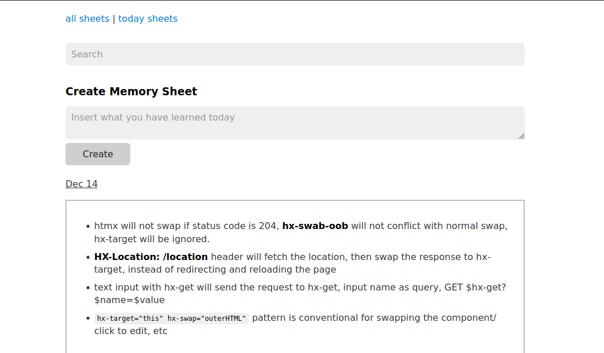
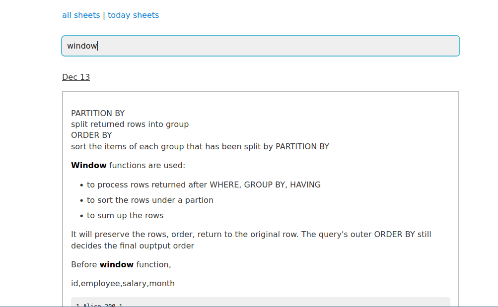
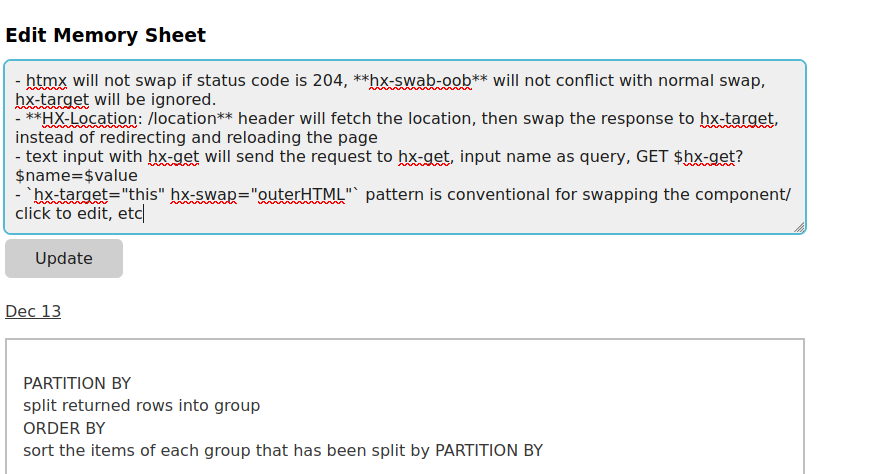

# Memory Sheets

A spaced repetition system designed to help you remember information in long-term memory using a customizable reminder pattern.

## How It Works

Notes are stored as markdown files in the `/sheets` folder organized by date. The app uses a spaced repetition algorithm with a customizable pattern to determine when sheets should be reviewed.

## Technologies Used

Go, HTMX, Templ

## Running

Build and run the application:

```bash
go build
./memory-sheets
```

The server will start on `http://localhost:8033`, and visit it by clicking the magic auth link.

## Screenshots






